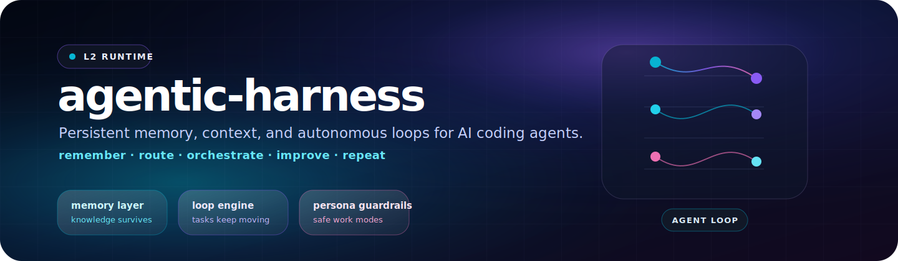

<div align="center">

<picture>
  <source media="(prefers-color-scheme: dark)" srcset="static/hero-banner.svg">
  <source media="(prefers-color-scheme: light)" srcset="static/hero-banner.svg">
  
</picture>

<br>
<br>

[](#personal-dx-stack)
[](#key-concepts)
[](#quick-start)
[](https://github.com/ulises-jeremias/agentic-harness/actions/workflows/ci.yml)

<h3>Persistent context and autonomous loops for AI-assisted delivery.</h3>

<p>
  <strong>agentic-harness</strong> is the runtime layer of my personal Developer Experience stack:<br>
  memory, personas, indexed repos, packs, queues, and feedback loops that keep AI work moving.
</p>

[Quick Start](#quick-start) · [Key Concepts](#key-concepts) · [Docs](#docs) · [Personal DX Stack](#personal-dx-stack) · [Contributing](CONTRIBUTING.md)

Works with **Claude Code**, **opencode**, **Cursor**, **Gemini CLI**, and **GitHub Copilot**.

</div>

---

**agentic-harness** is the running instance layer of the agentic stack — it gives your AI persistent memory, project context, persona-based guardrails, and loop orchestration that survives across sessions.

Think of it as the **operating system for your AI coding agents**.

```text
     Your AI Tool  ←→  agentic-harness  ←→  Your Repos
                        (memory, context,
                         loops, personas,
                         job queues)
```

---

## Quick Start

> "You shouldn't be prompting coding agents anymore. You should be designing loops that prompt your agents." — *Peter Steinberger*

```bash
# 1. Clone as your personal workspace
git clone <this-repo> ~/.agentic-harness
cd ~/.agentic-harness
./scripts/workspace-init.sh

# 2. Index a repo
./bin/project-indexer clone owner/my-repo

# 3. Start a daily issue triage loop (L1 = observe only, no writes)
./bin/loop init daily-triage
./bin/loop run daily-triage

# 4. Review what the loop found
cat loops/daily-triage/runs/*/report.md

# 5. Check cost and status
./bin/loop status
./bin/loop audit daily-triage

# 6. Open in your AI tool for interactive sessions
opencode        # or: claude / cursor / gemini
```

> **The loop runs autonomously between your sessions.** Wire it to a scheduler when you're ready to upgrade to L2 (PR-gated).

See [docs/LOOPS.md](docs/LOOPS.md) for the full loop reference and anti-patterns.

### Workspace branch modes

```bash
# Personal workspace (default) — creates branch: user-workspace/<username>
./scripts/workspace-init.sh

# Shared team workspace — creates branch: account-workspace/<name>
./scripts/workspace-init.sh --account-workspace=my-team
```

> [!TIP]
> Edit `.workspace.yaml` after setup to set your GitHub org and default clone directory.

---

## Key Concepts

<table>
  <tr>
    <td width="50%" valign="top">
      <h3>🔄 Agentic Harness</h3>
      <sub>The workspace acts as a harness — it doesn't replace your AI tool, it amplifies it by providing context, memory, and routing that survives across sessions.</sub>
    </td>
    <td width="50%" valign="top">
      <h3>🧬 Ralph Loop</h3>
      <sub>The four-stage loop your AI runs in:</sub>
      <br>
      <code>Backing Specs → Context Engineering → Persistent Memory → Fix the Loop</code>
      <br><br>
      <sub>Each session, the AI reads <code>AGENTS.md</code> → checks <code>knowledge/</code> → works → saves discoveries. The loop improves itself over time.</sub>
    </td>
  </tr>
  <tr>
    <td width="50%" valign="top">
      <h3>🎭 Personas</h3>
      <sub>Personas constrain what the AI <em>does</em> in a session — not who it is. <code>personas/reviewer.md</code> means "analyze and report, no changes".</sub>
      <br><br>
      <sub>Available:<br>
      🛠️ <code>implementer</code> · 🔍 <code>reviewer</code> · 🔬 <code>researcher</code> · 🏗️ <code>architect</code></sub>
    </td>
    <td width="50%" valign="top">
      <h3>📦 Packs</h3>
      <sub>Packs bundle project-specific context (repos, process docs, IDs, credentials) so you can switch between clients or projects with a single command.</sub>
      <br><br>
      <sub><code>./bin/workspace-context load packs/my-client.yaml</code></sub>
    </td>
  </tr>
  <tr>
    <td width="50%" valign="top">
      <h3>⏳ DevCompanion Queue</h3>
      <sub>Background job queue for async tasks — code reviews, refactors, CI fixes, investigations. Jobs run in a separate agent session and leave artifacts.</sub>
      <br><br>
      <sub><code>./bin/devcompanion queue my-project --template code-review</code></sub>
    </td>
    <td width="50%" valign="top">
      <h3>🧠 Persistent Memory</h3>
      <sub>Your AI remembers across sessions. <code>knowledge/</code> stores processes, learnings, todos, and patterns — indexed, searchable, and version-controlled.</sub>
      <br><br>
      <sub><code>./bin/assistant-memory search "topic"</code></sub>
    </td>
  </tr>
</table>

---

## 📁 Structure

```text
agentic-harness/
├── AGENTS.md              # AI orchestration instructions (main config)
├── CLAUDE.md              # Symlink → AGENTS.md (opencode/Cursor)
├── GEMINI.md              # Symlink → AGENTS.md (Gemini CLI)
├── bin/
│   ├── project-indexer    # Clone repos + manage symlinks
│   ├── assistant-memory   # Knowledge base CLI (search, add, inject)
│   ├── devcompanion       # Background job queue
│   └── workspace-context  # Session state snapshot
├── docs/                  # Guides, references, and methodology
├── knowledge/             # Persistent AI memory (learnings, todos, patterns)
├── personas/              # Work mode definitions (implementer, reviewer, etc.)
├── packs/                 # Context bundles per client/project
├── templates/jobs/        # Job templates for devcompanion
├── projects/              # Symlinks to repos (local, gitignored)
└── repos/                 # Cloned repos (local, gitignored)
```

---

## Docs

| Guide | Description |
|-------|-------------|
| [`docs/SETUP.md`](docs/SETUP.md) | Initial setup and AI tool configuration |
| [`docs/METHODOLOGY.md`](docs/METHODOLOGY.md) | The agentic harness philosophy |
| [`docs/WORKFLOWS.md`](docs/WORKFLOWS.md) | Task routing and skill usage patterns |
| [`docs/LOOPS.md`](docs/LOOPS.md) | Loop engineering reference and anti-patterns |
| [`docs/PERSONAS.md`](docs/PERSONAS.md) | Work mode personas lifecycle |
| [`docs/PACKS.md`](docs/PACKS.md) | Context packs for project switching |
| [`docs/PROJECTS.md`](docs/PROJECTS.md) | Managing repos and symlinks |
| [`docs/DEVCOMPANION.md`](docs/DEVCOMPANION.md) | Background job queue guide |
| [`docs/KNOWLEDGE.md`](docs/KNOWLEDGE.md) | Knowledge base usage |
| [`CONTRIBUTING.md`](CONTRIBUTING.md) | How to extend and contribute |

---

## Personal DX Stack

<table>
  <tr>
    <td width="33%" valign="top">
      <strong>dotfiles</strong><br>
      <sub>The personal operating layer: shell, editor, terminal, packages, and day-to-day ergonomics.</sub>
      <br><br>
      <a href="https://github.com/ulises-jeremias/dotfiles"><code>ulises-jeremias/dotfiles</code></a>
    </td>
    <td width="34%" valign="top">
      <strong>agentic-workstation</strong><br>
      <sub>The AI-native workstation baseline: skills, agents, MCP templates, CLI helpers, and setup automation.</sub>
      <br><br>
      <a href="https://github.com/ulises-jeremias/agentic-workstation"><code>ulises-jeremias/agentic-workstation</code></a>
    </td>
    <td width="33%" valign="top">
      <strong>agentic-harness</strong><br>
      <sub>The running instance layer: persistent memory, indexed repos, personas, packs, and background loops.</sub>
      <br><br>
      <a href="https://github.com/ulises-jeremias/agentic-harness"><code>ulises-jeremias/agentic-harness</code></a>
    </td>
  </tr>
</table>

Together, these three projects form my personal workspace: a polished Developer Experience / UX system that optimizes setup, context switching, AI-assisted delivery, and daily workflow automation.

---

## ✅ Validation

```bash
# Verify setup
./bin/project-indexer list          # shows indexed repos
./bin/assistant-memory todo         # shows pending items
./bin/workspace-context             # session state snapshot

# Queue a test job
./bin/devcompanion queue my-project --template code-review
./bin/devcompanion run-once --no-llm
```

---

## 🐛 Troubleshooting

| Issue | Fix |
|-------|-----|
| `project-indexer: command not found` | Run `chmod +x ./bin/*` |
| DevCompanion: "No LLM provider" | Set `ANTHROPIC_API_KEY` or `OPENAI_API_KEY` |
| Pending jobs stuck | Run `./bin/devcompanion status` |
| Skills not loading | Check your AI tool's skill pack configuration |

---

<div align="center">

**⭐ Star this repo** if you use it — it helps others discover it.

[Report a bug](https://github.com/ulises-jeremias/agentic-harness/issues/new) · [Request a feature](https://github.com/ulises-jeremias/agentic-harness/issues/new)

<sub>Built with ❤️ for AI-assisted software delivery</sub>

</div>

## 👥 Contributors

<a href="https://github.com/ulises-jeremias/agentic-harness/contributors">
  
</a>

Made with [contributors-img](https://contrib.rocks).