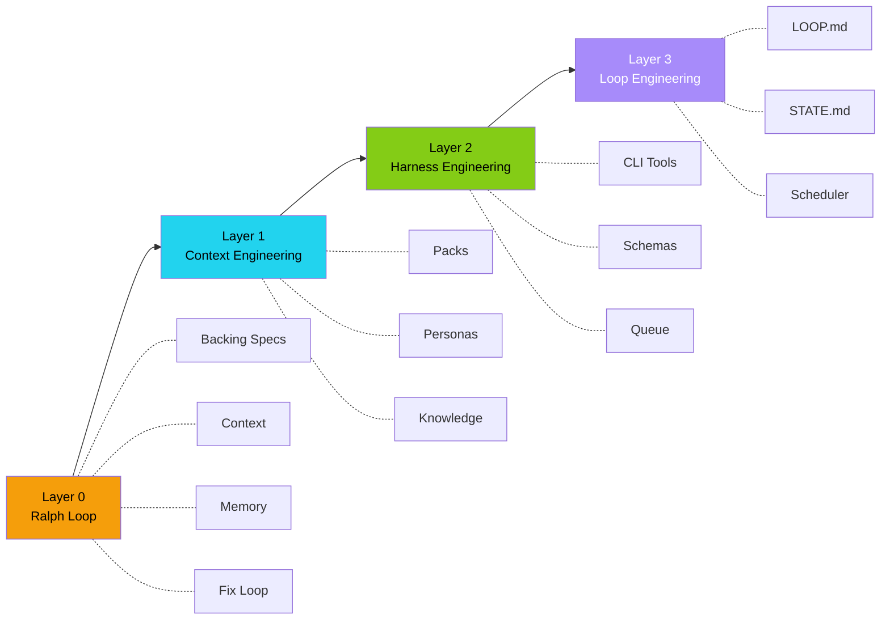

# Architecture — agentic-harness

> Visual overview of the agentic-harness component architecture and data flow.

---

## High-Level Architecture

```mermaid
graph TB
    subgraph "User / AI Tool"
        AI[Claude Code / opencode / Cursor / Copilot / Gemini CLI]
    end

    subgraph "Context Layer"
        AGENTS[AGENTS.md<br/>Routing Table]
        PACKS[packs/*.yaml<br/>Project Context]
        PERSONAS[personas/*.md<br/>Behavioral Guardrails]
        PROFILES[profiles/*.yaml<br/>Session Bundles]
        KNOWLEDGE[knowledge/<br/>Persistent Memory]
    end

    subgraph "Harness Layer"
        WCTX[bin/workspace-context<br/>Session Snapshot]
        AMEM[bin/assistant-memory<br/>Knowledge CLI]
        DC[bin/devcompanion<br/>Job Queue]
        PI[bin/project-indexer<br/>Repo Manager]
        SCHEMAS[schemas/<br/>JSON Schema Validation]
    end

    subgraph "Loop Layer"
        LOOP[bin/loop<br/>Loop Orchestrator]
        TEMPLATES[templates/loops/<br/>Loop Templates]
        SCHEDULER[Scheduler<br/>systemd / launchd]
    end

    subgraph "Infrastructure"
        REPOS[repos/<br/>Cloned Projects]
        PROJS[projects/<br/>Symlinks]
        JOBS[templates/jobs/<br/>Job Templates]
        EXAMPLES[examples/<br/>Walkthroughs]
    end

    subgraph "External"
        WS[agentic-workstation<br/>Skills + Agents]
        GIT[GitHub / GitLab<br/>Repositories]
    end

    AI --> AGENTS
    AGENTS --> WCTX
    WCTX --> PACKS
    WCTX --> PERSONAS
    WCTX --> PROFILES
    WCTX --> KNOWLEDGE
    WCTX --> WS

    AI --> AMEM
    AMEM --> KNOWLEDGE

    AI --> DC
    DC --> JOBS
    DC --> WS

    AI --> PI
    PI --> REPOS
    PI --> PROJS
    PI --> GIT

    AI --> LOOP
    LOOP --> TEMPLATES
    LOOP --> SCHEDULER
    LOOP --> WCTX
    LOOP --> AMEM

    SCHEMAS --> PACKS
    SCHEMAS --> PERSONAS
    SCHEMAS --> PROFILES
    SCHEMAS --> KNOWLEDGE
    SCHEMAS --> TEMPLATES

    style AI fill:#a78bfa,stroke:#7c3aed,color:#fff
    style AGENTS fill:#22d3ee,stroke:#06b6d4,color:#000
    style WCTX fill:#84cc16,stroke:#65a30d,color:#000
    style LOOP fill:#f59e0b,stroke:#d97706,color:#000
    style KNOWLEDGE fill:#ec4899,stroke:#db2777,color:#fff
    style WS fill:#6366f1,stroke:#4f46e5,color:#fff
```



---

## Component Reference

### Context Layer (L1)

| Component | Location | Purpose |
|-----------|----------|---------|
| **AGENTS.md** | Repo root | Stateless orchestration rules, routing table, skill definitions |
| **Packs** | `packs/*.yaml` | Per-project context bundles: repos, IDs, conventions, LLM policy |
| **Personas** | `personas/*.md` | Work mode constraints with allow/deny/handoff rules |
| **Profiles** | `profiles/*.yaml` | Bundled sessions combining pack + persona + skills |
| **Knowledge Base** | `knowledge/` | Persistent cross-session memory: learnings, processes, todos |

### Harness Layer (L2)

| Component | Location | Purpose |
|-----------|----------|---------|
| **workspace-context** | `bin/workspace-context` | Generates session snapshot: packs, personas, skills, knowledge |
| **assistant-memory** | `bin/assistant-memory` | Search, add, inject, and review knowledge entries |
| **devcompanion** | `bin/devcompanion` | Background job queue: code reviews, PRs, CI fixes, investigations |
| **project-indexer** | `bin/project-indexer` | Clone repos and manage symlinks in projects/ |
| **Schema Validation** | `schemas/` | JSON Schema validation for all context surfaces |

### Loop Layer (L3)

| Component | Location | Purpose |
|-----------|----------|---------|
| **loop** | `bin/loop` | Loop orchestrator: init, run, status, audit, cost estimation |
| **Loop Templates** | `templates/loops/` | 7 reusable templates: daily-triage, pr-babysitter, ci-sweeper, etc. |
| **Scheduler** | systemd / launchd | OS-level timer integration for autonomous execution |

---

## Data Flow

### Session Start

```text
1. AI reads AGENTS.md
   └─ Routing table → which skills to use for each task type

2. Load pack or profile
   └─ workspace-context load --pack <name>
      └─ snapshot includes: repos, conventions, IDs, LLM policy

3. Prime context
   └─ workspace-context (snapshot)
   └─ assistant-memory inject (knowledge entries)
```

### During Work

```text
4. Discover work via skill delegation
   └─ jira-assistant → find assigned issues
   └─ clickup-cli → check sprint backlog

5. Execute with sub-agents
   └─ planner → implementation plan
   └─ implementer → write code
   └─ code-reviewer → review changes

6. Save learnings
   └─ assistant-memory add --type learning "pattern discovered"
```

### Between Sessions

```text
7. Loops run autonomously (if scheduled)
   └─ bin/loop run daily-triage
      └─ scans issues → updates STATE.md → applies exit conditions

8. Dev companion processes queue
   └─ bin/devcompanion run-once
      └─ picks up queued jobs → runs LLM-powered worker → updates status
```

---

## Layer Dependency



Each layer can be adopted independently. You can use context engineering without loops. To get autonomous loops, you need all three.

---

## External Dependencies

| System | Integration | Where |
|--------|------------|-------|
| **agentic-workstation** | Skills, agents, MCP templates, devcompanion runner | `~/.local/share/agentic-workstation/` |
| **GitHub** | Repositories, PRs, issues | Via `gh` CLI + `project-indexer` |
| **GitLab** | Repositories, MRs, issues | Via `glab` CLI + `project-indexer` |
| **Jira / ClickUp / Linear** | Task management | Via skills from agentic-workstation |
| **systemd / launchd** | Loop scheduling | OS-level timer units / plists |
